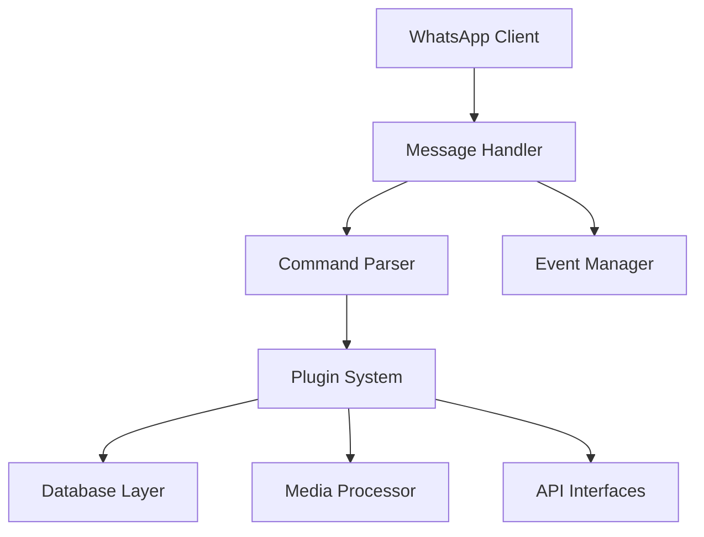

<div align="center">
  
</div>

<div align="center">
  
</div>

<h1 align="center">🤖 Lilith - WhatsApp Bot </h1>

<p align="center">
  <em>A Cutting-Edge WhatsApp Bot Built with Python & Asynchronous Technology</em>
</p>

<p align="center">
  
</p>

<div align="center">
  
[](https://GitHub.com/Naereen/StrapDown.js/graphs/commit-activity)
[](https://www.python.org/)
[](https://github.com/ZulX88/Shiro-Py/blob/main/LICENSE)
[](https://github.com/ZulX88/Shiro-Py/stargazers)
[](https://github.com/ZulX88/Shiro-Py/issues)

</div>

---

## 🌟 About Lilith

<div align="center">
  
</div>

Lilith is an advanced WhatsApp bot meticulously crafted with Python and asynchronous technology for optimal performance. Designed to revolutionize your WhatsApp automation experience, this bot combines cutting-edge functionality with elegant design.

### ✨ Key Features

<div align="center">
  
| 🚀 **Performance** | 🔧 **Customization** | 📱 **Integration** |
|:---:|:---:|:---:|
| Asynchronous architecture for lightning-fast responses | Modular design for easy customization | Seamless WhatsApp API integration |

| ⚡ **Responsiveness** | 📥 **Media Handling** | 🔐 **Security** |
|:---:|:---:|:---:|
| Real-time processing with minimal latency | Advanced media processing capabilities | Secure environment configuration |

</div>

### 🎯 Core Capabilities

- **Message Processing**: Sophisticated message parsing and handling
- **Media Management**: Advanced media upload and download capabilities  
- **Database Integration**: Robust SQLite and PostgreSQL support
- **Event Handling**: Comprehensive event-driven architecture
- **Plugin System**: Extensible plugin architecture for easy feature additions

---

## 📊 GitHub Stats

<div align="center">
  

  
</div>

<div align="center">
  

  
</div>

---

## 🏗️ Architecture Overview

### Core Components

<div align="center">
  


</div>

### Message Serialization (`lib/serialize.py`)

The `serialize.py` module provides powerful message handling capabilities:

#### **Mess Class**
Handles incoming messages with properties like:

- `text`: Extracts message text content
- `is_media`: Checks if the message contains media
- `quoted`: Access to quoted/replied messages
- `mentioned_jid`: Gets mentioned user IDs
- `media_info`: Extracts detailed media information
- `reply()`: Reply to messages
- `react()`: React to messages with emojis

#### **QuotedMess Class**
Handles quoted/replied messages with:

- Media download capabilities
- Context information extraction
- Message type detection

---

## 📚 Quick Start

<div align="center">
  
### Prerequisites
[](https://www.python.org/downloads/)
[](https://pip.pypa.io/en/stable/)

</div>

### Installation

<div align="center">
  
#### 🚀 Rapid Deployment
```bash
git clone https://github.com/ZulX88/Shiro-Py.git
cd Shiro-Py
pip install -r requirements.txt
```

</div>

### Step-by-Step Setup

1. **Clone the Repository**
   ```bash
   git clone https://github.com/ZulX88/Shiro-Py.git
   cd Shiro-Py
   ```

2. **Install Dependencies**
   ```bash
   pip install -r requirements.txt
   ```

3. **Configure Environment**
   ```bash
   cp .env.example .env
   # Edit .env with your configurations
   ```

4. **Generate Session**
   ```bash
   python3 gen.py
   ```

5. **Run the Bot**
   ```bash
   python3 -m main
   ```

> ⚠️ **Note**: Follow the instructions that appear during session generation to connect with your WhatsApp.

---

## ⚙️ Configuration

<div align="center">
  
### Environment Variables
```env
PREFIXES=/
NAMEDB=db.sqlite3
OWNER=62xxx,84xxx
BOT_NAME=Lilith Bot
```

</div>

| Variable | Description | Default |
|----------|-------------|---------|
| **PREFIXES** | Command prefixes for the bot | `/` |
| **NAMEDB** | Database file name | `db.sqlite3` |
| **OWNER** | Owner numbers (comma-separated) | `62xxx,84xxx` |
| **BOT_NAME** | Display name for the bot | `Lilith Bot` |

---

## 🗂️ Project Structure

<div align="center">
  
```
Shiro-Py/
├── main.py                 # 🖥️  Main bot entry point
├── gen.py                  # 🔐  Session generation script  
├── handler.py              # 🤖  Message handler
├── config.py               # ⚙️  Configuration settings
├── requirements.txt        # 📦  Python dependencies
├── .env.example           # 🔐  Environment variables template
├── files/                 # 📁  Static files directory
├── lib/                   # 🧩  Core library modules
│   ├── serialize.py       # 📬  Message serialization
│   └── scrape/            # 🌐  Scraping utilities
└── plugins/               # 🔌  Bot plugins directory
    ├── downloader/        # 📥  Download plugins
    └── general/           # 🧩  General plugins
```

</div>

---

## 🧩 Available Plugins

<div align="center">
  
| Plugin Category | Functionality | Status |
|----------------|---------------|--------|
| 📥 **Downloader** | Media download capabilities | ✅ Active |
| 🧩 **General** | Basic bot commands | ✅ Active |
| 🎵 **Music** | Music search and download | 🔄 Coming Soon |
| 🤖 **AI** | Artificial intelligence features | 🔄 Coming Soon |

</div>

---

## 🤝 Contribution

<div align="center">
  
[](https://github.com/ZulX88/Shiro-Py/pulls)
[](https://github.com/ZulX88/Shiro-Py/graphs/contributors)

</div>

We warmly welcome your contributions! To contribute:

1. **Fork** the repository
2. **Create** your feature branch (`git checkout -b feature/AmazingFeature`)
3. **Commit** your changes (`git commit -m 'Add some AmazingFeature'`)
4. **Push** to the branch (`git push origin feature/AmazingFeature`)
5. **Open** a Pull Request

<div align="center">

### 🌟 Contributors
<a href="https://github.com/ZulX88/Shiro-Py/graphs/contributors">
  
</a>

</div>

---

## 📈 Activity Insights

<div align="center">
  

  
</div>

---

## 🏆 Achievements

<div align="center">
  

  
</div>

---

## 🙏 Acknowledgments

<div align="center">
  
- Special thanks to [@Nubuki-all](https://github.com/Nubuki-all) for the [amazing documentation](https://nubuki-all.github.io/neonize)! 🙏
- Inspired by the open-source community and developers worldwide 💙
- Built with [neonize](https://github.com/krypton-byte/neonize) framework 🚀

</div>

---

## 📞 Connect with Me

<div align="center">
  
[](https://github.com/ZulX88) 
[](https://twitter.com/ZulX88) 
[](https://linkedin.com/in/ZulX88)
[](https://instagram.com/ZulX88)

</div>

---

## 💰 Support the Project

<div align="center">
  
If you find Lilith useful, consider supporting the project:
  
[](https://saweria.co/zhansetya)
[](https://ko-fi.com/yourusername)

</div>

<div align="center">
  


</div>

---

<div align="center">
  
### 🌟 Thank You for Visiting!

[](https://github.com/ZulX88/Shiro-Py/stargazers)
  
</div>

<div align="center">
  
<a href="#top">
  
</a>

</div>

<p align="center">
  
</p>

</div>
</div>

<p align="center">
  Made with ❤️ by <a href="https://github.com/ZulX88">ZulX88</a> | 🤖 Lilith Bot - Your Ultimate WhatsApp Assistant
</p>